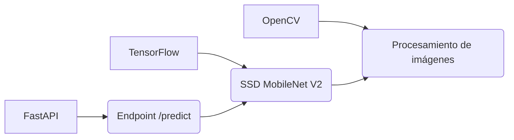

# 🚀 PythonIA_Convulent - API de Detección de Objetos con COCO

> *"Detección de objetos en tiempo real con modelo pre-entrenado SSD MobileNet V2"*

## 🌟 **Características Clave**
- 🖼️ Detección de objetos usando el dataset **COCO**
- ⚡ API REST con **FastAPI** para integración sencilla
- 🚦 Soporte para CORS (ideal para frontends)
- 📦 Modelo pre-entrenado **SSD MobileNet V2** listo para producción

## 🛠️ **Stack Tecnológico Exacto**

