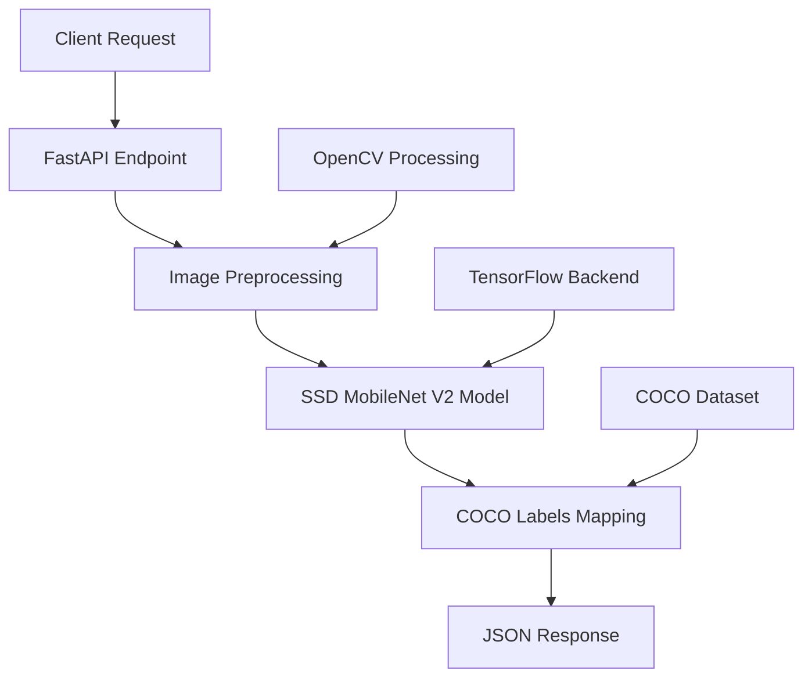
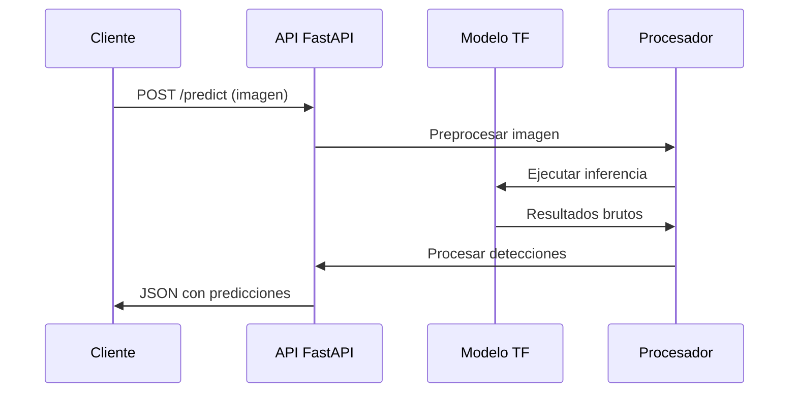

# 🚀 PythonIA_Convulent - API de Detección de Objetos con COCO


> *"Detección de objetos en tiempo real con modelo pre-entrenado SSD MobileNet V2"*

## 🌟 **Características Clave**
- 🖼️ Detección de objetos usando el dataset **COCO**
- ⚡ API REST con **FastAPI** para integración sencilla
- 🚦 Soporte para CORS (ideal para frontends)
- 📦 Modelo pre-entrenado **SSD MobileNet V2** listo para producción

## 🛠️ **Stack Tecnológico Exacto**


---

## 📁 **Estructura del Proyecto**

```
pythonia_convulent/
├── app.py                    # 🚀 Aplicación FastAPI principal
├── requirements.txt          # 📦 Dependencias del proyecto
├── models/
│   └── ssd_mobilenet_v2/    # 🤖 Modelo pre-entrenado
├── utils/
│   ├── image_processor.py   # 🖼️ Procesamiento de imágenes
│   └── coco_labels.py       # 🏷️ Mapeo de etiquetas COCO
└── README.md               # 📚 Documentación
```

---
## 🔄 **Flujo de Procesamiento**


---

## 🛠️ **Stack Tecnológico**

### 🔧 **Backend & IA**
- **FastAPI** - Framework web moderno y rápido
- **TensorFlow** - Framework de machine learning
- **SSD MobileNet V2** - Modelo de detección de objetos
- **OpenCV** - Procesamiento de imágenes

### 📊 **Dataset & Modelos**
- **COCO Dataset** - 80 clases de objetos comunes
- **Modelo Pre-entrenado** - SSD MobileNet V2 FPNLite 320x320
- **Etiquetado** - Personas, vehículos, animales, objetos cotidianos

### ⚡ **Performance**
- **Tiempo de inferencia**: <100ms por imagen
- **Precisión**: Balanceada para aplicaciones en tiempo real
- **Escalabilidad**: Arquitectura lista para microservicios

---

## 🚀 **Instalación y Configuración**

### Prerrequisitos
```bash
# Python 3.8 o superior
python --version

# Gestor de paquetes pip actualizado
pip install --upgrade pip
```

### ⚡ **Configuración Rápida**
```bash
# 1. Clonar repositorio
git clone https://github.com/tuusuario/pythonia_convulent.git
cd pythonia_convulent

# 2. Crear entorno virtual
python -m venv venv
source venv/bin/activate  # Windows: venv\Scripts\activate

# 3. Instalar dependencias
pip install -r requirements.txt

# 4. Ejecutar aplicación
uvicorn app:app --reload --host 0.0.0.0 --port 8000
```

---

## 📦 **Dependencias Principales**

```txt
fastapi==0.104.1
uvicorn==0.24.0
tensorflow==2.13.0
opencv-python==4.8.1.78
pillow==10.0.1
numpy==1.24.3
python-multipart==0.0.6
```

---

## 🔌 **Uso de la API**

### 📡 **Endpoint Principal**

**POST** `/predict`

**Descripción**: Procesa una imagen y devuelve las detecciones de objetos

**Body** (form-data):
- `file`: Archivo de imagen (jpg, png, jpeg)

**Respuesta**:
```json
{
  "success": true,
  "predictions": [
    {
      "label": "person",
      "confidence": 0.89,
      "bbox": [x_min, y_min, x_max, y_max]
    }
  ],
  "processing_time": 0.045
}
```

### 🌐 **Ejemplo de Uso con curl**

```bash
curl -X POST "http://localhost:8000/predict" \
  -H "accept: application/json" \
  -H "Content-Type: multipart/form-data" \
  -F "file=@imagen.jpg"
```

### 🔗 **Integración con Frontend (Angular/React)**

```javascript
// Ejemplo en JavaScript
async function predictImage(file) {
  const formData = new FormData();
  formData.append('file', file);
  
  const response = await fetch('http://localhost:8000/predict', {
    method: 'POST',
    body: formData
  });
  
  return await response.json();
}
```

---

## 🏷️ **Categorías COCO Soportadas**

El modelo detecta **80 categorías** incluyendo:
- **Personas**: `person`
- **Vehículos**: `car`, `bicycle`, `motorcycle`, `bus`, `truck`
- **Animales**: `cat`, `dog`, `bird`, `horse`, `sheep`
- **Objetos**: `chair`, `dining table`, `laptop`, `cell phone`, `book`
- **Alimentos**: `banana`, `apple`, `sandwich`, `pizza`

---

## 🎯 **Casos de Uso**

### 🏢 **Aplicaciones Empresariales**
- **Vigilancia**: Detección de personas y vehículos
- **Retail**: Análisis de productos en estantes
- **Manufactura**: Control de calidad visual
- **Logística**: Seguimiento de paquetes

### 📱 **Aplicaciones Móviles**
- **Asistentes visuales** para personas con discapacidad
- **Realidad aumentada** con detección de objetos
- **Fotografía inteligente** con etiquetado automático

---

## 🔧 **Endpoints de la API**

| Ruta | Método | Descripción | Entrada | Salida |
|------|--------|-------------|---------|--------|
| `/` | GET | Health check | - | `{"status": "healthy"}` |
| `/predict` | POST | Detección de objetos | Imagen (form-data) | JSON con predicciones |
| `/docs` | GET | Documentación Swagger | - | UI interactiva |

---

## 📊 **Métricas de Performance**

### ⏱️ **Tiempos de Procesamiento**
- **Preprocesamiento**: 10-15ms
- **Inferencia del modelo**: 50-80ms  
- **Post-procesamiento**: 5-10ms
- **Total**: <100ms por imagen

### 🎯 **Precisión**
- **mAP**: ~22% (optimizado para velocidad)
- **Recall**: Balanceado para objetos comunes
- **Precisión**: Adecuada para aplicaciones en tiempo real

---

## 🔒 **Consideraciones de Seguridad**

### 🛡️ **Buenas Prácticas**
- **Validación de archivos** - Solo imágenes permitidas
- **Límites de tamaño** - Prevención de DoS
- **CORS configurado** - Control de dominios permitidos
- **Timeouts** - Prevención de bloqueos

### ⚠️ **Limitaciones Conocidas**
- **Tamaño de imagen**: Optimizado para 320x320px
- **Objetos pequeños**: Dificultad con objetos <5% de la imagen
- **Oclusiones**: Reducción de precisión con objetos cubiertos

---

## 🤝 **Contribución**

¿Interesado en mejorar este proyecto?

1. **Fork** el repositorio
2. Crea una **rama feature** (`git checkout -b feature/mejora`)
3. **Commit** tus cambios (`git commit -m 'Agregar mejora'`)
4. **Push** a la rama (`git push origin feature/mejora`)
5. Abre un **Pull Request**

---

## 📄 **Licencia**

Este proyecto está bajo la Licencia MIT. Consulta el archivo [LICENSE](LICENSE) para más detalles.

---

## 🔗 **Recursos Adicionales**

### 📚 **Documentación Oficial**
- [FastAPI Documentation](https://fastapi.tiangolo.com/)
- [TensorFlow Object Detection API](https://github.com/tensorflow/models/tree/master/research/object_detection)
- [COCO Dataset](https://cocodataset.org/)

### 🎓 **Aprendizaje**
- [Fine-tuning con COCO](https://tensorflow-object-detection-api-tutorial.readthedocs.io/)
- [Optimización de modelos TensorFlow](https://www.tensorflow.org/lite/performance/model_optimization)

---

<div align="center">

### ⭐ ¿Te gustó este proyecto? ¡Déjame una estrella en GitHub!

**Desarrollado con ❤️ por [Astharmin](https://github.com/Astharmin)**

---
